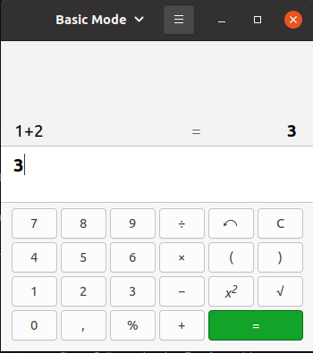

# Update

The [issue](https://gitlab.com/dogtail/dogtail/-/issues/37) that was avoiding the execution of test was solved doing [this](https://gitlab.com/dogtail/dogtail/-/issues/37#note_2304763633). So, if you face this error, this it. As the issue was solved I'm adding the files with the example. Check more datails in [The context of the issue](#The-context-of-the-issue)

To run, use `venv`

```
python -m venv venv
source venv/bin/activate
```

# Introduction
[Dogtail](https://gitlab.com/dogtail/dogtail) is a GUI test tool and automation framework written in ​Python.

## Test explanation
Before executing this example make sure your host matches the [requirements](https://gitlab.com/dogtail/dogtail#dependencies) to install dogtail.

This example opens the Linux `GNOME Calculator`, sums 1 and 2. You will find the transactions to `Open` and `Close` the `GNOME Calculator` and the ones to click the buttons to `Sum` the numbers.
The outpout is:
```
examples/linux_desktop/dogtail/test_integration_with_dogtail.py::TestLinuxCalculatorWithDogtail::test_local_page 
--------------------------------------------------------------- live log setup ---------------------------------------------------------------
2025-01-19 03:39:37.341 INFO Transaction 'setup.OpenApp'
--------------------------------------------------------------- live log call ----------------------------------------------------------------
2025-01-19 03:39:37.364 INFO Transaction 'calculator.Sum'
2025-01-19 03:39:37.365 INFO  a: 1
2025-01-19 03:39:37.365 INFO  b: 2
2025-01-19 03:39:40.908 INFO Assertion 'Shows'
2025-01-19 03:39:40.999 INFO  actual:   '[application | gnome-calculator]'
2025-01-19 03:39:41.000 INFO  expected: '3'
PASSED                                                                                                                                 [100%]
------------------------------------------------------------- live log teardown --------------------------------------------------------------
2025-01-19 03:39:41.000 INFO Transaction 'setup.CloseApp'
```

## The context of the issue

Dogtail is a pain in the ass to install. I did it once with `virtualenv` for Python 3.8 only.

```shell
virtualenv --system-site-packages env
source env/bin/activate
pip install dogtail
```

While testing with Python3.11 lots of errors happened in special this one that I couldn't find a solution. If some one knows how to solve it, please, let me know. I tried all tips from Stack Overflow and other sources.

```shell
______________________________________ ERROR collecting examples/linux_desktop/test_linux_calculator.py ______________________________________
ImportError while importing test module '/home/douglas/repo/guara/examples/linux_desktop/test_linux_calculator.py'.
Hint: make sure your test modules/packages have valid Python names.
Traceback:
/usr/local/lib/python3.11/importlib/__init__.py:126: in import_module
    return _bootstrap._gcd_import(name[level:], package, level)
examples/linux_desktop/test_linux_calculator.py:4: in <module>
    from examples.linux_desktop.screens import calculator, setup
examples/linux_desktop/screens/setup.py:1: in <module>
    import dogtail.tc
env/lib/python3.11/site-packages/dogtail/tc.py:151: in <module>
    from dogtail.tree import Node
env/lib/python3.11/site-packages/dogtail/tree.py:6: in <module>
    from dogtail import rawinput
env/lib/python3.11/site-packages/dogtail/rawinput.py:7: in <module>
    from pyatspi import Registry as registry
E   ModuleNotFoundError: No module named 'pyatspi'
```

So, to not give up of the exercise, I made all the changes in Python 3.8 in [this repository](https://github.com/douglasdcm/automacao_de_testes/tree/dogtail-and-guara/ferramentas/05_dogtail/examples/linux_desktop). It was necessary to copy the core code of Guara to the root page as shown [here](https://github.com/douglasdcm/automacao_de_testes/tree/dogtail-and-guara/ferramentas/05_dogtail/guara) and I had to change the `Application` class like this:

before

```python
class AbstractTransaction:
    def __init__(self, driver: WebDriver):
        self._driver = driver

    def do(self, **kwargs) -> Any | NoReturn:
        raise NotImplementedError
```

after

```python
class AbstractTransaction:
    def __init__(self, driver: WebDriver):
        self._driver = driver

    def do(self, **kwargs):
        raise NotImplementedError
```
With these adaptations it was possible to organize the automation to open the Linux calculator, sum two numbers and assert it. I'll paste the static code here just as inspiration, but `it is possible that you will not be able to use it in Python 3.11 and Guara without fixing the issues of dogtail's installation`.

## Folder structure
```
examples
  linux_desktop
    screens # contains the transactions to intwract with the calculator
      calculator.py # has transactions to add, subtract,...
      setup.py # has transactions to open and close the calculator
    test_page_transactions.py # has the test cases
```

calculator.py

```python
from guara.transaction import AbstractTransaction

from dogtail.tree import root
from dogtail.rawinput import pressKey, keyNameAliases


class Add(AbstractTransaction):
    """
    Sums two numbers

    Args:
        a (int): The 1st number to be added
        b (int): The second number to be added

    Returns:
        the application (self._driver)
    """

    def __init__(self, driver):
        super().__init__(driver)

    def do(self, a, b):
        self._driver.child(str(a)).click()
        self._driver.child("+").click()
        self._driver.child(str(b)).click()
        pressKey(keyNameAliases.get("enter"))
        return self._driver
```

setup.py

```python
from dogtail.tree import root

from dogtail.procedural import run, focus, click
from dogtail.utils import screenshot
from guara.transaction import AbstractTransaction


class OpenApp(AbstractTransaction):
    """
    Opens the App

    Returns:
        The calculator application
    """

    def __init__(self, driver):
        super().__init__(driver)

    def do(self):
        return self._driver


class CloseApp(AbstractTransaction):
    """
    Closes the App
    """

    def __init__(self, driver):
        super().__init__(driver)

    def do(self):
        screenshot()
        click("Close")
```

test_page_transactions.py

```python
from dogtail.tree import root
from dogtail.procedural import run, focus

from examples.linux_desktop.screens import calculator, setup

from guara.transaction import Application
from guara import it


class ItShows(it.IAssertion):
    """
    It checks if the value is shown in the calculator

    Args:
        actual (application): The calculator object
        expected (int): the value that should be present in the screen
    """

    def __init__(self):
        super().__init__()

    def asserts(self, actual, expected):
        assert actual.child(str(expected)).showing


class TestLinuxCalculator:
    def setup_method(self, method):
        # Dogtail first runs the app and then gets the application.
        # So the calculator is opened direclty in the fixture.
        # This is an exception when compared against with other drivers like Selenium
        # that first gets the driver and then opens the app
        app_name = "gnome-calculator"
        run(app_name)
        focus.application(app_name)
        driver = root.application("gnome-calculator")
        
        self._calculator = Application(driver=driver)
        self._calculator.at(
            setup.OpenApp,
        )

    def teardown_method(self, method):
        self._calculator.at(setup.CloseApp)

    def test_local_page(self):
        self._calculator.at(calculator.Add, a=1, b=2).asserts(ItShows, 3)
```
When it is executed this is the output
```shell
examples/linux_desktop/test_page_transactions.py::TestLinuxCalculator::test_local_page 
--------------------------------------------------------------- live log setup ---------------------------------------------------------------
00:13:34 INFO Transaction 'setup.OpenApp'
--------------------------------------------------------------- live log call ----------------------------------------------------------------
00:13:35 INFO Transaction 'calculator.Add'
00:13:35 INFO  a: 1
00:13:35 INFO  b: 2

00:13:39 INFO Assertion 'ItShows'
00:13:39 INFO  actual:   '[application | gnome-calculator]'
00:13:39 INFO  expected: '3'
PASSED                                                                                                                                 [100%]
------------------------------------------------------------- live log teardown --------------------------------------------------------------
00:13:39 INFO Transaction 'setup.CloseApp'
```
Screenshot

