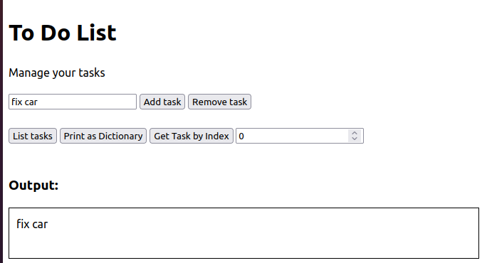

# Prototypes and Page Transactions

It is not the primary goal of the `Page Transactions` pattern, but since it adheres to the `Command Pattern (GoF)`, it can also be effectively utilized in product development. An experiment was conducted using a simple web application to manage `To-Do` lists. I employed [Pyscript](https://pyscript.net/) to create the front-end of the prototype and Page Transactions (Guara) to handle the back-end logic. The result was highly satisfactory, especially for someone like me, who is not particularly skilled in front-end development. Within just a few minutes, I was able to design the transactions, test them, and leverage the Application invoker to seamlessly connect the back-end with the front-end.

By using Guara for both product implementation and testing, we save significant time and streamline repetitive processes. Additionally, testing the prototype aligns well with the shift-left principle, which emphasizes performing tests in the earliest stages of the development cycle.

Experiment the application:

1. Start a simple Web server
```
python -m http.server
```
2. Access `http://localhost:8000`



3. Interact with the page
4. Add more transactions ot `operation.py` file and bind them with Pyscript using the `Application` involker. It is necessary to restart the server and refresh the page to apply the changes.

# A brief explanation of the code

> [!TIP]
> The complete code is in `todo` folder. You can get and change it to to your demanad.

This code implements a To-Do application using Python. Here's a detailed breakdown of the code's functionality:
Core Classes and Logic

1. ToDoPrototype

    Acts as the driver or storage for tasks.
    Tasks are stored in a list (self._tasks).
    Provides getter (tasks) and setter (tasks) properties to manage the list of tasks.

2. Transaction Classes

These classes inherit from AbstractTransaction (likely part of the guara.transaction library) and define operations on the task list:

    Add:
        Adds a new task to the list.
        Throws a ValueError if the task is empty or whitespace.
        Returns the updated task list.

    Remove:
        Removes a task from the list.
        If the task does not exist, returns a message saying the task was not found.

    ListTasks:
        Returns the entire list of tasks.

    PrintDict:
        Converts the list of tasks into a dictionary where:
            Keys are task indices (as strings, starting from "1").
            Values are the tasks themselves.

    GetBy:
        Retrieves a task by its index in the list.
        If the index is invalid, it returns "No task".

3. Application Instance

The Application object (app) is initialized with a ToDoPrototype instance. This enables communication between the front-end and back-end operations.
Front-End Interaction

The document object (from pyscript) allows the Python code to interact with the HTML DOM. The functions below define event handlers for front-end interactions:

add_task(event)

    Retrieves the task value from an HTML element with id="task".
    Adds the task using the Add transaction.
    Updates the DOM element #output to display feedback.

remove_task(event)

    Retrieves the task value from the input field (id="task").
    Removes the task using the Remove transaction.
    Displays feedback in the #output element.

print_task_dict(event)

    Calls the PrintDict transaction to generate a dictionary representation of tasks.
    Displays the dictionary in the #output element.

list_tasks(event)

    Calls the ListTasks transaction to retrieve the full list of tasks.
    Displays the list in the #output element.

get_task(event)

    Retrieves the task index from an input field (id="index-input").
    Calls the GetBy transaction to fetch the task at the given index.
    Displays the task or an error message in the #output element.

Key Features

    Transaction-Based Architecture:
        Each task operation (add, remove, list, etc.) is encapsulated in a transaction class. This ensures clear separation of concerns.

    Integration with Front-End:
        Uses pyscript for interaction with the DOM, making the code suitable for web-based applications.

    Error Handling:
        Errors like invalid task input or invalid index are handled gracefully and provide user feedback.

Example Workflow

    A user types a task in the input field (id="task") and clicks an "Add Task" button.
        add_task is triggered, which adds the task to the internal storage and updates the UI.

    The user can view all tasks (as a list or dictionary) or retrieve a specific task by its index using list_tasks, print_task_dict, or get_task.

    If a task needs to be removed, the user types its name and clicks a "Remove Task" button, which triggers remove_task.

This structure is modular, making it easy to extend and maintain.


