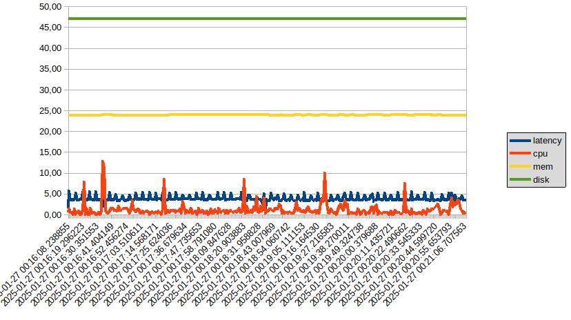

# Profile

Test executed on Guará commit 0f96115cba2df18647ea2bd8f9f5f304610b7681

## Host configuration
```
uname --all
Linux douglas 5.4.0-204-generic #224-Ubuntu SMP Thu Dec 5 13:38:28 UTC 2024 x86_64 x86_64 x86_64 GNU/Linux
```

## Setup
- Close all apps leaving just the terminal open

## Script
Detail: The `App` instance is reused for all iterations

```python
import time
import datetime
import psutil
import logging
import transactions
from guara.transaction import Application
from guara import it


class App:

    def __init__(self):
        self._todo = Application(transactions.ToDoPrototype())

    def run(self):
        task_1 = "buy banana"
        task_2 = "buy apple"
        task_3 = "buy orange"
        expected = [task_1, task_2, task_3]
        self._todo.at(transactions.Add, task=task_1).asserts(it.IsEqualTo, [task_1])
        self._todo.at(transactions.Add, task=task_2)
        self._todo.at(transactions.Add, task=task_3)

        sub_set = [task_1, task_3]
        result = self._todo.at(transactions.ListTasks).result
        it.HasSubset().validates(result, sub_set)
        it.IsSortedAs().validates(result, expected)

        key_value = {"1": task_1}
        self._todo.at(transactions.PrintDict).asserts(it.HasKeyValue, key_value)

        task_4 = "buy watermelon"
        index = 3
        pattern = "(.*)melon"
        self._todo.at(transactions.Add, task=task_4)
        self._todo.at(transactions.GetBy, index=index).asserts(it.MatchesRegex, pattern)

        self._todo.at(transactions.Remove, task=task_1)
        self._todo.at(transactions.Remove, task=task_2)
        self._todo.at(transactions.Remove, task=task_3)
        self._todo.at(transactions.Remove, task=task_4)


if __name__ == "__main__":
    logging.basicConfig(
        level=logging.INFO,
        format="%(asctime)s.%(msecs)03d %(levelname)s %(message)s",
        datefmt="%Y-%m-%d %H:%M:%S",
        force=True,
        filename="main.log",
        filemode="w",
    )
    LOGGER = logging.getLogger("guara")

    SECONDS = 60 * 5
    s = time.time()
    csv_writer = "data.csv"
    app = App()
    with open(csv_writer, mode="w", newline="") as f:
        f.write("time,latency,cpu,mem,disk\n")
        while time.time() - s < SECONDS:
            start = time.time()
            app.run()
            end = time.time()
            f.write(
                ",".join(
                    [
                        str(datetime.datetime.now()),
                        str((end - start) * 10**3),
                        str(psutil.cpu_percent(interval=1)),
                        str(psutil.virtual_memory().percent),
                        str(psutil.disk_usage("/").percent),
                        "\n",
                    ]
                )
            )
            f.flush()

```

## Load

- Rump up: 0
- Execution time: `60 * 5 SECONDS`
- Pacing: 0
- Think Time: 0
- Rump down: 0

Description
- Ramp up: the elapsed time seting up the resources before the main execution
- Execution time: is the elapsed time the test was executed
- Pacing: the sleep time between on iteration to other
- Think time: the sleep time between one transaction to other
- Rump down: the elapsed time disposing the resources raised in the rump up

## Execution

```
~/guara$ python tests/performance/script_1.py
```

## Analysis


- All metrics are stable (no increasing) during the tests
- There are some CPU spikes, but they are constant during the execution